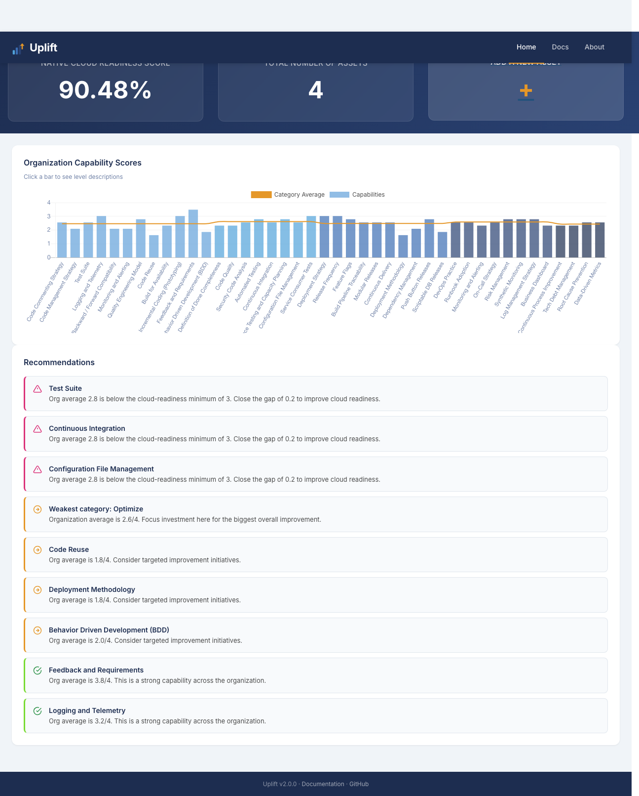
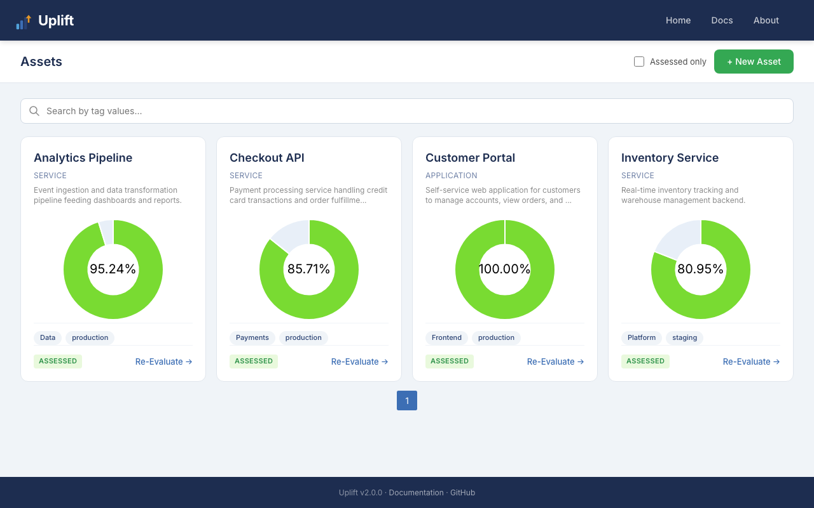
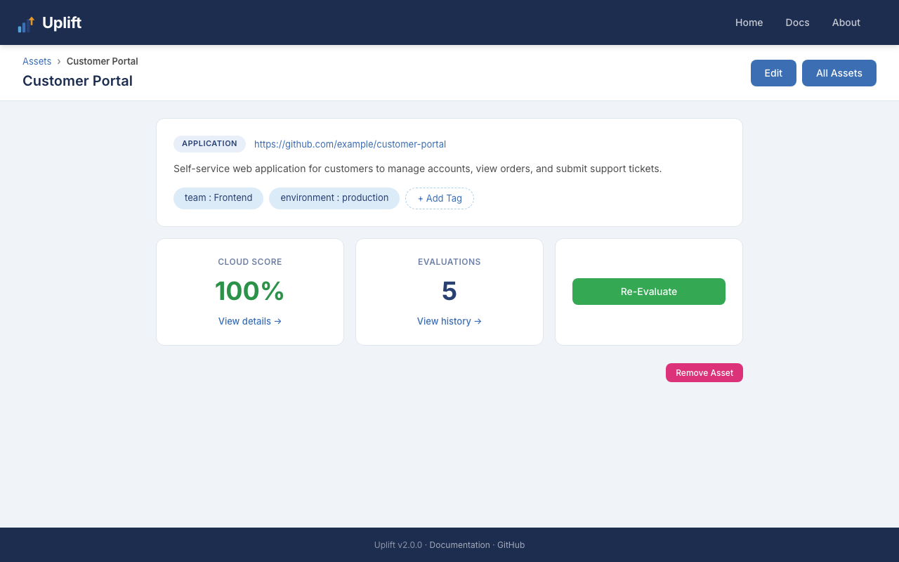
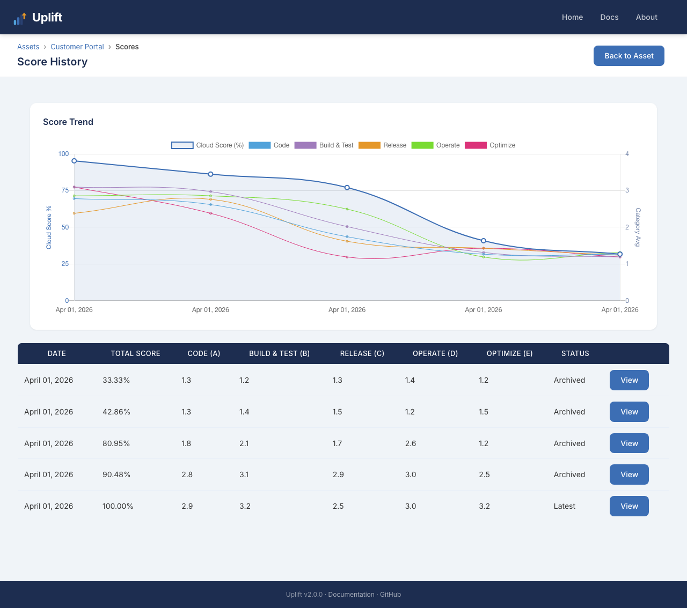

<p align="center">
  
</p>

# Uplift

Assessment portal that measures product maturity across five dimensions of software development. Teams self-assess against 42 capabilities scored on a 1-4 scale, producing a maturity profile that highlights strengths, gaps, and cloud-readiness.

## Screenshots









## The Maturity Model

Products are evaluated across five categories:

| Category | Capabilities | Focus |
|---|---|---|
| **Code** | 12 | Code quality, testing, monitoring, BDD, reuse |
| **Build and Test** | 8 | CI, security scanning, performance testing, automation |
| **Release** | 10 | Deployment strategy, CD, feature flags, dependency management |
| **Operate** | 8 | DevOps practice, on-call, runbooks, SLA monitoring |
| **Optimize** | 4 | Process improvement, tech debt, root cause analysis, metrics |

21 of the 42 capabilities have minimum thresholds that define cloud-readiness requirements. The overall cloud score reflects how many of these thresholds are met.

See [docs/capabilities.md](docs/capabilities.md) for the full model with scoring rubrics.

## Quick Start

```bash
python -m venv .venv
source .venv/bin/activate
pip install -e ".[dev]"
uvicorn app.main:app --reload
```

Open http://localhost:8000

## Docker

### SQLite (default)

```bash
docker-compose up --build
```

### PostgreSQL

```bash
docker-compose -f docker-compose.postgres.yml up --build
```

## Configuration

All settings use the `UPLIFT_` env var prefix:

| Variable | Default | Description |
|---|---|---|
| `UPLIFT_DATABASE_URL` | `sqlite:///./uplift.db` | Database connection string |
| `UPLIFT_ENABLE_ASSET_CREATION` | `true` | Allow creating new products |
| `UPLIFT_ENABLE_FIRST_TIME_USER_EXP` | `true` | Show first-time user experience |
| `UPLIFT_ENABLE_TAG_MODIFICATION` | `true` | Allow modifying tags |
| `UPLIFT_SEED_DB` | `true` | Seed example products on first start |
| `UPLIFT_SLACK_ENDPOINT` | | Slack webhook URL |
| `UPLIFT_SLACK_CHANNEL` | | Slack channel name |

## Tests

```bash
pytest
```

## Credit

Based on the [techmaturity](https://github.com/techmaturity/techmaturity) framework and maturity model by Ticketmaster.
